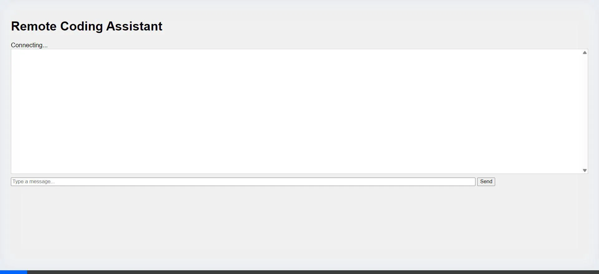

# Remote Coding Assistant

## Setup

1.  **Install Dependencies**:
    ```bash
    pip install -r backend/requirements.txt
    ```

2.  **Environment Variables**:
    Create a `.env` file in `backend/` with:
    ```
    GEMINI_API_KEY=your_api_key_here
    ```

## Running the System

1.  **Start the Backend**:
    ```bash
    cd backend
    python main.py
    ```
    The server will start at `http://localhost:8000`.

2.  **Start the Frontend**:
    Open `frontend/index.html` in your browser.

## Usage

-   **Drop Zone**: Drop folders into the `drop_zone` directory in the root. The system will automatically ingest them.
-   **Chat**: Use the frontend to chat with the agent.

## Architecture Graph

```mermaid
graph TD
    User[User] -->|Drops Folder| Watcher[File Watcher]
    User -->|Chats| API[FastAPI Backend]
    
    subgraph "Hybrid Intelligence"
        API --> Orchestrator
        Orchestrator -->|High Complexity| Gemini[Gemini (Manager)]
        Orchestrator -->|Low Complexity| Local[Ollama (Worker)]
    end
    
    Watcher --> Ingest[Ingestion Pipeline]
    Ingest -->|Summarize| Local
    Ingest -->|Store| VectorDB[(ChromaDB)]
    
    Gemini -->|Plan/Reason| Response
    Local -->|Task Result| Response
    Response --> API
```

## Screenshots



