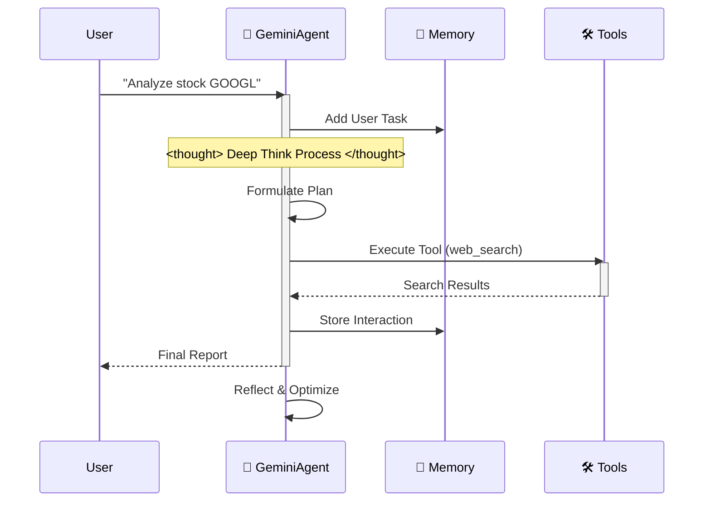

# 🪐 Google Antigravity Workspace Template (Enterprise Edition)


Welcome to the **Antigravity Workspace Template**. This is a production-grade starter kit for building autonomous agents on the Google Antigravity platform.

## 🧠 How It Works

The agent follows a strict "Think-Act-Reflect" loop, simulating the cognitive process of Gemini 3.



## ✨ Key Features

- **Auto-Configuration**: `.cursorrules` loads the "Google Antigravity Expert" persona.
- **Modular Architecture**: Logic separated into `src/` (Agent, Memory, Config).
- **DevOps Ready**: Includes `Dockerfile`, `docker-compose.yml`, and CI/CD workflows.
- **Type-Safe**: Built with `pydantic` and strict type hints.

## 🚀 Quick Start

### Local Development
1.  **Install Dependencies**:
    ```bash
    pip install -r requirements.txt
    ```
2.  **Run the Agent**:
    ```bash
    python src/agent.py
    ```

### Docker Deployment
1.  **Build & Run**:
    ```bash
    docker-compose up --build
    ```

## 🗺️ Roadmap

- [x] **Phase 1: Foundation** (Scaffold, Config, Memory)
- [x] **Phase 2: DevOps** (Docker, CI/CD)
- [ ] **Phase 3: Advanced Memory** (Vector Database Integration)
- [ ] **Phase 4: Multi-Agent Orchestration** (Swarm Protocol)
- [ ] **Phase 5: Dashboard** (Streamlit UI for Agent Monitoring)

## 📂 Project Structure

```
.
├── .context/           # AI Knowledge Base
├── .github/            # CI/CD Workflows
├── src/                # Source Code
│   ├── agent.py        # Main Agent Logic
│   ├── config.py       # Settings Management
│   ├── memory.py       # JSON Memory Manager
│   └── tools/          # Agent Tools
├── tests/              # Test Suite
├── .cursorrules        # AI Persona Config
├── Dockerfile          # Production Build
├── docker-compose.yml  # Local Dev Setup
└── mission.md          # Agent Objective
```

---
*Generated by Google Antigravity*
